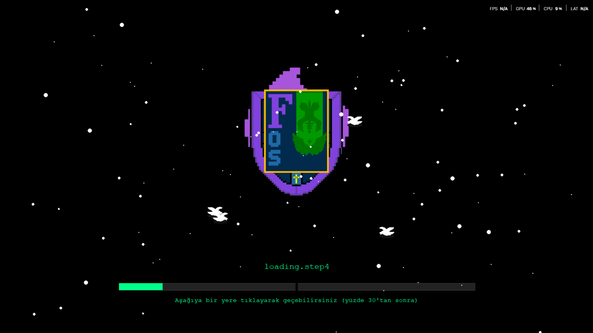

## DO NOT BELIEVE LINKS ABOUT DOWNLOAD FORZEOS. ONLY TRUE DOWNLOAD IS FROM THIS PAGE 


# 🚀 ForzeOS
**A high-performance Linux-like desktop simulation environment built with Python 3.11 for Windows.**

USERNAME - admin

PASSWORD - Forze esp32

> [!WARNING]
> **ForzeOS is NOT for Linux.** It is specifically designed to create and simulate a Linux-style desktop workspace, terminal, and AI integration within a Windows environment.

---

## 🛠️ Installation & Setup
Follow these steps to get ForzeOS running on your system:

1. **Install Dependencies:**
   ```powershell
   pip install -r requirements.txt
   ```
2. **Note for Linux Users:** If you are testing specific modules on a Linux kernel, ensure you have Python 3 installed:
   ```bash
   sudo apt install python3
   ```
3. **External Requirements:** To use video and editor features, you must install **VLC Media Player** and **FFmpeg**.
   * **VLC Path Configuration:** Ensure your `VLC_PLUGIN_PATH` is correctly mapped in your config:
     `r"C:\Program Files\VideoLAN\VLC\plugins"`

4. **Launch the System:** Run the launcher to start the desktop space:
   ```powershell
   python forze_launcher.py
   ```

---

## 📂 Project Architecture
**Note:** All `.py` files must remain in the same root directory for the system to link correctly.

### 🧠 Core & System Modules
* **Kernel Simulation:** `ForzeOS System.py`, `forzeos_core.py`
* **AI & Hybrid Assistants:** `assistant_ai.py`, `assistant_ai_offline.py`, `hybrid_assistant.py` (Manages memory via `assistant_memory_large.json`)
* **Utilities:** `forze_audio_settings.py`, `forze_wikipedia.py`, `math_engine.py`, `forzeos_focus.py`
* **Web Integration:** `forzeos_pyqt_browser.py`, `forzeos_pywebview_process.py`

### ⚡ C++ Hybrid Integration
ForzeOS utilizes compiled C++ for high-performance window management:
* `forze_agressive_focus.cpp`: Handles window priority and "aggressive" focus management for a seamless experience.

### ⚙️ Configuration & Assets
* `forzeos_config.json`: Central configuration file for paths, AI settings, and UI tweaks.
* `forze_assets/`: Directory containing system icons and AI stabilization assets.

---

## ⌨️ Controls & Navigation
* **Toggle Focus:** `Control + Shift + M`
* **Navigation:** Use `Tab` to cycle through elements and `Esc` to exit or go back.

---

## 🤝 Contributing
ForzeOS is an evolving project. Feel free to fork, report issues, or submit pull requests!

### Loading screen 


GitHub için daha etkili ve "teknik" bir İngilizce README metni arıyorsan, işte profesyonel bir taslak:

---

# ForzeOS 💻

**ForzeOS** is a comprehensive operating system simulation developed with Python and Tkinter, featuring a modular desktop environment, an integrated AI assistant, and a wide array of built-in applications.

---

## 🚀 About the Project

ForzeOS is more than just a standard Python project; it is a modular architecture designed to optimize system resources. By leveraging C++ DLLs for Windows system management and boasting over 100,000 lines of code, it provides a sophisticated desktop experience.

## 🛠 Key Features

* **Custom Desktop Environment:** Features a functional taskbar, icon management, and a custom window manager.


* **C++ DLL Optimization:** Uses custom C++ DLLs to manage system resources and enhance performance.


* **Integrated AI Assistant:** Includes an offline AI assistant with persistent memory, capable of handling commands and interactions.


* **Rich Application Ecosystem:** Comes pre-loaded with a web browser, PDF reader, video player, AES-encrypted password manager, and more.


* **Gaming Suite:** Includes interactive games such as Chess (with AI), Snake, Flappy Bird, and Tic-Tac-Toe.


* **Focus Modes:** Features an advanced "Focus Mode" designed for aggressive performance optimization.


## 📐 Technical Architecture

| Component | Technology |
| --- | --- |
| **GUI** | Tkinter |
| **Backend** | Python 3.x |
| **System Hooks** | C++ DLLs |
| **AI Engine** | N-gram Vectorization |
| **Mobile Port** | Termux + XFCE + VNC |

## 💡 Git clone and use 

```bash
# Clone the repository
git clone https://github.com/your-username/ForzeOS.git

# Install dependencies
pip install -r requirements.txt

# Launch the OS
python main.py

```

## 🏗 Development Notes

* **Modular Design:** The system employs a "lazy loading" mechanism, ensuring that heavy libraries are only loaded into RAM when strictly necessary.


* **Performance:** Optimized for efficient task handling and system resource management.


## 👥 Credits

* **Code:** Forze


* **Design:** Felina


* **Innovation:** RRaings


---

*ForzeOS is developed for educational and personal use. Development is currently ongoing.*

---


